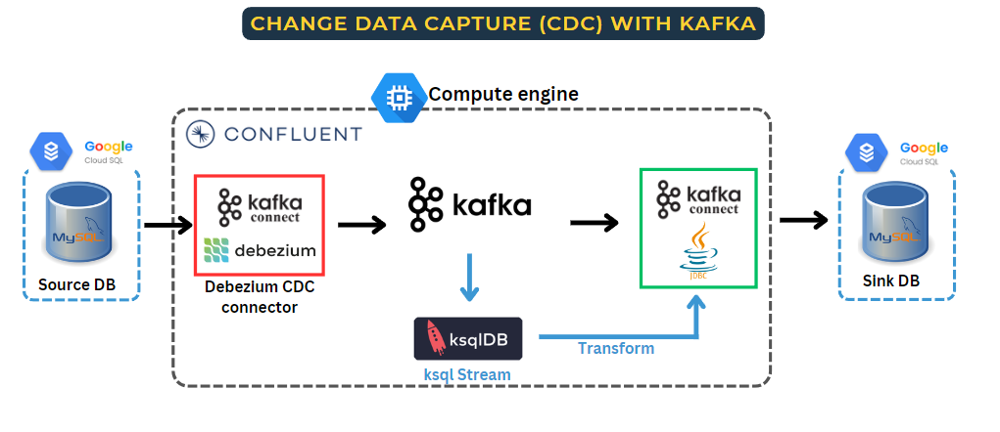

# Change data capture with Kafka

#### This project focuses on implementing Change Data Capture (CDC) to replicate data from a source database to a destination database using Kafka. 
#### The following steps outline the process:

#### 1.Set up the Source and Destination Databases:
- Both the source and destination databases are hosted on Google Cloud SQL.

#### 2.Configure Debezium CDC Connector:
- Utilize the Debezium CDC connector to capture changes from the source database.
- This connector captures data changes in real-time and transforms them into a stream of events.

#### 3.Set up Kafka Cluster Managed by Confluent:
- Create a Kafka cluster managed by Confluent, which will serve as the central event streaming platform.
- The Kafka cluster is deployed on Docker, running on Google Cloud Compute Engine.
- Ensure proper network connectivity between the Kafka cluster, source database, and destination database.

#### 4.Replicate Data with Kafka Connect JDBC Connector:
- Use the JDBC connector provided by Kafka Connect to sink the captured data from the Kafka cluster to the destination database.
- Configure the connector to establish a connection with the destination database and maintain data consistency during the replication process.

#### 5.Perform Real-time Transformations using ksqlDB:
- Utilize ksqlDB, a streaming SQL engine for Apache Kafka, to create a stream for real-time data transformations.
- Implement necessary transformations on the data stream to match the desired format and structure of the destination database.

